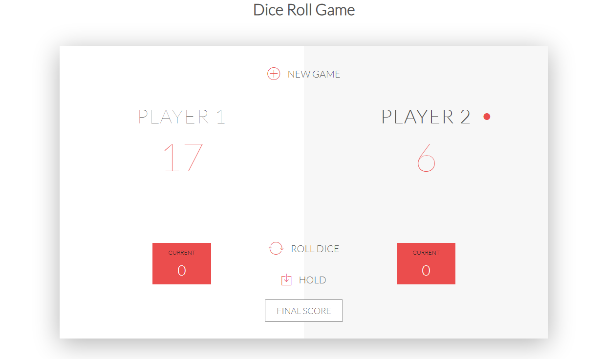

# Dice Roll Game using JavaScript

Dice Roll Game is a project that is a multi-player game where goal is to get a highest dice roll. The game has a simple design that contains an image of a dice. The purpose of the game is to provide some fun with your friends.

# About the System
The Dice Roll Game was created in a HTML web browser that use JavaScript module that add some newly advance coding methods for a better user interaction. The game is playable through web browser that visualize the lines and the box grid line. The player can play the game Mouse, you just only need to use the Left Mouse Button to interact the dice. The game is so simple you just need to get a high roll to win the game. You can store your rolled number if you are satisfy for the digit you get by clicking the hold button. The game is very fun because two players can play this game, try to defeat your opponent and try to achieve the highest rolled dice. This application is for educational purpose only, feel free to modify it as you fit your needs. The Dice Roll Game was created using basic JavaScript coding techniques that provide some simple coding methods.

# Features:
* Simple GUI
The project contains simple UI such text and images.
* Basic Controls
This project uses a basic control that needed to interact with the game.
* User-friendly Interface
This project was design in a simple user-friendly interface web application.

# Installation:
1. Extract the zip file.
2. Find and locate the file "index.html".
3. Open the file in a web browser

FOR YOUR OWN SAFETY, PLEASE:

1. Re-scan downloaded files using your personal virus checker before using it.
2. NEVER, EVER run compiled files (.exe's, .ocx's, .dll's etc.)--only run source code.
